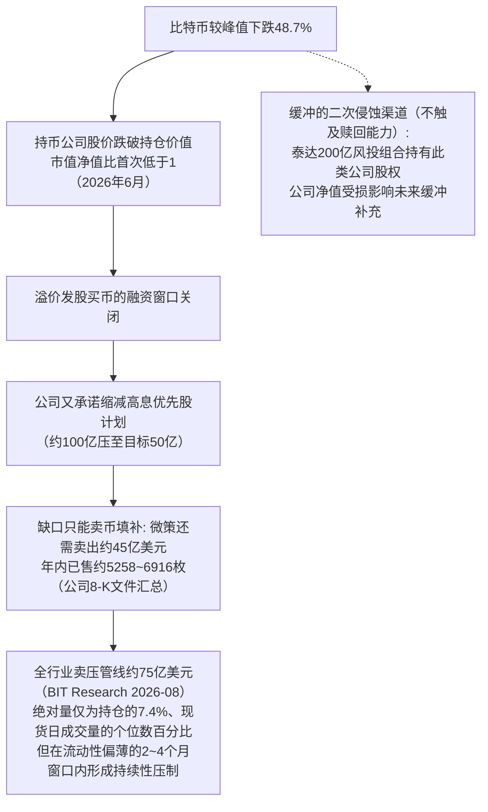
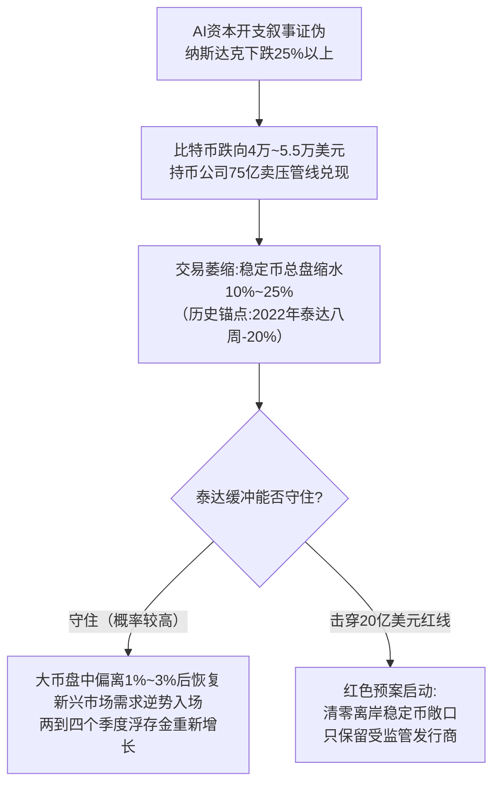
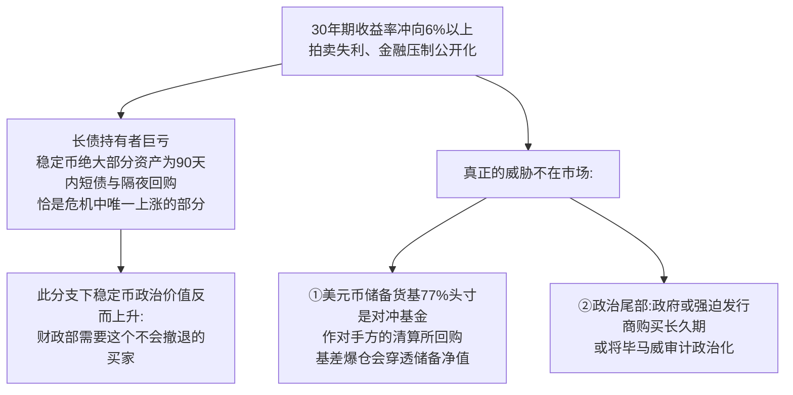

# 稳定币全景研究

## ——抵押物 · 使用者 · 危机推演

> 数据截至 2026 年 8 月 26 日。标注【分析师判断】处为逻辑推演而非统计事实。

> **名词对照**：USDT＝泰达币（全球第一大稳定币）；USDC＝美元币（Circle 公司发行，第二大）；CRCL＝Circle 公司股票代码；COIN＝Coinbase 公司股票代码；MSTR＝微策公司（Strategy，原 MicroStrategy）股票代码；GENIUS 法案＝美国《稳定币创新引导与建立法案》；短债／国库券＝一年内到期的美国国债；DAT＝数字资产金库公司（主业为囤积加密货币的上市公司）；市值净值比＝公司股价与其所持加密货币价值的比值。

---

## 〇、核心数字速览：稳定币撬动了多少美国国债？

  

| 问题             | 数字                                                                                                                                                    |
| -------------- | ----------------------------------------------------------------------------------------------------------------------------------------------------- |
| 已锁定国债存量        | 约 **2,200 亿美元**（口径见附录 A1）                                                                                                                             |
| 占比             | 可流通国债（31.5 万亿美元）的 **0.70%**；短债市场（6.69 万亿）的 **3.3%**                                                                                                   |
| 未来累计撬动（本文中心预测） | 2028 年底 ≈ **+6,900 亿**；2030 年底 ≈ **+1.5～2 万亿**（方法论见附录 A2）                                                                                             |
| 官方共识           | 财政部借款咨询委员会／财长贝森特／渣打：2028 年总盘 2 万亿 → **+1.69 万亿**；花旗牛市情景 2030 年 3.7 万亿 → **+3.4 万亿**                                                                   |
| 收益率影响          | 短端累计压缩约 **15～30 个基点**，承压期放大 2～3 倍（国际清算银行实证）                                                                                                           |
| 给财政部省多少利息？     | 共识路径下每年约 **100～160 亿美元**，两条渠道构成：①直接利差——增量持仓×收益率压缩 15～30 个基点 ≈ 34 亿/年；②期限替代红利——若允许财政部把约 9,000 亿原定长债改以短债发行，再省约 130 亿/年。**若只计本文中心情景的利差压缩，为每年 30～60 亿美元** |

*数据来源：财政部公共债务月报（2026-06）、证券业及金融市场协会统计（2026-07）、投资公司学会货币基金周报（2026-08-19）。注：31.5 万亿为可流通国债口径；含政府内部持有的总债务约 40 万亿。*

---
## 一、抵押物解剖：钱到底在哪

### 1.1 主要稳定币背后装着什么

| 稳定币                   | 规模         | 抵押物构成                                                                                                                                                                                                                                                                         | 抵押率                                                                  | 核验                    |
| --------------------- | ---------- | ----------------------------------------------------------------------------------------------------------------------------------------------------------------------------------------------------------------------------------------------------------------------------- | -------------------------------------------------------------------- | --------------------- |
| **泰达 USDT**           | 1,832 亿    | 按二季度审计原值（2026-06-30）：直接国债＋国债隔夜回购合计约 **1,410 亿**；黄金 188.3 亿（146.2 吨）；比特币 58.0 亿（**98,933 枚，按市价 58,642 美元/枚计**）；担保贷款 135 亿；现金及其他投资约 86 亿。五项加总＝1,877.5 亿＝总资产；负债（代币）1,836.4 亿。另设**独立于储备的逾 200 亿美元风投组合**（投 AI、能源与持币上市公司股权，用利润出资）【Tether 经 BDO 审计的二季度报告，2026-07-31；四季度审计公告 2026-02】 | **102.2%**（缓冲 41.1 亿；一季度曾达 82.3 亿即 104.5%，二季度因黄金/比特币跌价单季腰斩——偿付核心未受损） | BDO 季度审计；毕马威全面年度审计进行中 |
| **美元币 USDC**          | 739 亿      | 86% 在贝莱德管理的政府货基（隔夜三方回购为主，经美国固定收益清算公司结算）；其余为系统重要性银行存款；**无任何非国债资产**。注意其货基中 77% 头寸是对冲基金作对手方的清算所回购【纽约联储博客 2026-07】                                                                                                                                                                | 约 100%                                                               | 格兰特桑顿月度＋年报审计          |
| **瑞波美元 RLUSD**        | 14 亿       | 只许短债＋现金，禁商业票据；储备略高于流通量                                                                                                                                                                                                                                                        | ~107%                                                                | 德勤月度                  |
| **全球美元 USDG**         | 33 亿       | 现金＋三个月内短债＋隔夜回购＋政府货基                                                                                                                                                                                                                                                           | ~100%                                                                | 毕马威月度                 |
| **贝宝美元 PYUSD**        | 26 亿       | 短债＋隔夜回购＋现金                                                                                                                                                                                                                                                                    | ~100%                                                                | 月度核验                  |
| **USDS＋DAI**（Sky 协议）  | 流通合计 114 亿 | 总抵押品 143.9 亿：兑换模块中美元币约 48 亿＋超额抵押借贷金库＋短债现实资产＋AAA 公司债；**57.5% 的供应由治理信用额度铸出、无逐一锁定储备**                                                                                                                                                                                            | **136%（官方口径：总抵押品 ÷ 协议债务义务 105.8 亿）**；若按流通量 114 亿计则为 126%——差额即信用线铸造部分 | 链上实时可查；标准普尔评级 B-      |
| **USDe**（Ethena 合成美元） | 40.8 亿     | 去中心化借贷 46%＋流动稳定币 35%＋AAA 贷款凭证 11%＋机构放款 7%＋**加密基差套利仅剩 1%**（收益引擎近枯竭）                                                                                                                                                                                                            | 101.6%                                                               | 每周链上证明                |

*上表七家合计约 2,799 亿美元，覆盖全市场规模（3,120 亿）的约九成。【分析师判断】泰达把利润再投资于黄金、比特币与风投，其市值波动直接冲击缓冲数字——这是会计结构问题而非偿付问题。*

### 1.2 宏观定位

各家合计锁定美债约 **2,200 亿美元＝存量的 0.7%**，超过德国、澳大利亚、阿联酋任何一国主权持仓；泰达单家为**全球第 17 大美债持有者**。对照：日本 1.117 万亿、中国 6,330 亿（2008 年 9 月以来最低），外国官方自 2026 年 2 月以来净卖出 2,330 亿。【来源：财政部 TIC 国际资本报告 2026-06】——**稳定币是当前唯一结构性增长、且不可能被外国政府武器化的边际买家，这正是华盛顿推动立法的真实动机。**【分析师判断】

---

## 二、真实世界的使用者

### 2.1 两条平行的美元体系（DefiLlama 实拉，2026-08-26）

|      | 泰达币USDT（1,832 亿）     | 美元币USDC（739 亿）                              |
| ---- | -------------------- | ------------------------------------------- |
| 所在主链 | **波场链 49.9%**（915 亿） | 以太坊 63.8%、Solana 9.5%、Hyperliquid 衍生品链 9.0% |
| 用户画像 | **新兴市场普通人的口袋美元**     | **西方机构的结算层**                                |
结论："南半球现金"与"北半球结算层"两套体系并行，共享同一批美国国债作最终抵押品。

### 2.2 五类用户原型

| 原型         | 代表                                                                                                               | 关键证据                                                                      | 用途               |
| ---------- | ---------------------------------------------------------------------------------------------------------------- | ------------------------------------------------------------------------- | ---------------- |
| ① 恶性通胀储蓄者  | 尼日利亚（59% 持有率全球第一）、委内瑞拉（点对点挂单 90.2% 为泰达计价）、土耳其（一季度十国零售量榜中唯一正增长的主要市场：+7%，同期美国 -11%、韩国 -31%、俄罗斯 -13%）、阿根廷（占比 61.8%） | BVNK《稳定币效用报告 2026》；TRM Labs 2026 年一季度指数                                   | 平行储蓄货币、商户定价单位    |
| ② 受制裁国家机器  | 俄罗斯 A7 网络、伊朗 Nobitex、朝鲜拉撒路组织                                                                                     | **2025 年受制裁实体收到 ≥1,040 亿加密资产（同比 8 倍），稳定币占非法交易量 84%**【Chainalysis 2026-03】 | 采购结算＋内部记账        |
| ③ 汇款家庭     | 美→墨、海湾→南亚、非洲侨民                                                                                                   | Castle Island 调查：47% 用稳定币汇款                                               | 点对点转账，费率不足电汇十分之一 |
| ④ 企业结算层    | Visa（年化结算 70 亿）、开放美元联盟（140 家）、Mastercard（收购 BVNK）                                                                | Visa 官方公告 2026-07-16                                                      | 企业跨境、卡清算、周末结算    |
| ⑤ 去中心化金融金库 | Hyperliquid 链上 66.5 亿美元币、Sky 储蓄池（散户<1%）                                                                          | 四个匿名地址持 Sky 储蓄池三分之一【Crystal Intelligence 2026-06】                         | 收益策略、保证金         |

  

### 2.3 制裁经济要点（TRM 泄密文件分析 2026-06）

俄罗斯 A7 网络将泰达币USDT在莫斯科现货批发市场兑卢布，资金池分布吉尔吉斯斯坦/中国/埃及/土耳其/迪拜，与伊朗革命卫队、哈马斯、朝鲜黑客往来敞口 1.77 亿美元；伊朗央行半年内 3.47 亿美元经 Nobitex 路由；朝鲜年盗窃逾 20 亿美元（含 Bybit 的 14.6 亿史上最大案）。

### 2.4 机构格局：开放美元联盟

2026 年 6 月 30 日，140 余家企业（Visa、Mastercard、Stripe、贝莱德、谷歌、Shopify、纽约梅隆、渣打、星展、Coinbase 等）宣布共同发行"开放美元"：零铸造赎回费＋储备利息几乎全分给伙伴——对 GENIUS 禁息条款的联盟式绕道，长期将侵蚀 Circle 的利差垄断模式。【分析师判断】未来十二个月内 Circle 牌照先发优势仍稳固，2027 年后份额假设应下修。（eMarketer 2026-06-30、Visa 新闻稿 2026-07-16）

---

## 三、危机推演：债务危机与 AI 泡沫袭来时会发生什么

**四个情景分支与传导链路对应关系（可能同时或先后发生，并非互斥单选；概率为分析师判断，更新规则见附录 A3）：**

**甲＝滞胀僵持转暖（45%）｜乙＝AI 泡沫破裂（25%，即"链路一"）｜丙＝主权久期危机（20%，即"链路二"）｜丁＝快速降息（10%）**

  

### 3.1 当前坐标

美联储利率停在 3.50%～3.75%（7 月会议 9 比 3 维持、三人主张加息）；30 年期美债收益率一度破 5.3%（2007 年来新高），国债逼近 40 万亿，财政部加倍回购长债；比特币自峰值最深跌 48.7%，现约 79,000 美元；英伟达于本报告定稿当日盘后发布的财报指引罕见低于共识，AI 资本开支已吞掉云厂商九成以上经营现金流（高盛测算）。

**监测仪表盘构成**（免费公开数据源实算，每日更新）【实算源：DefiLlama、Gate.io、Hyperliquid、FRED，2026-08-26】：

| 指标                     | 权重*      | 当前读数（满分100） |
| ---------------------- | -------- | ----------- |
| 脱锚程度（价格偏离一美元的标准化分数）    | 0.36     | 10          |
| 净发行速度                  | 0.22     | 20          |
| 基差压力（永续资金费率减质押基准收益）    | 0.22     | 15          |
| 短债稀缺价差（三个月期国债收益率减隔夜利率） | 0.21     | 20          |
| 跨市场相关性密度               | 数据源缺失未计入 | —           |

综合 ≈ **15/100，绿色**。阈值：<40 绿／40–70 琥珀／>70 红；三个硬触发可越级拉红。*权重因第五项缺失按比例重分配。管道平静，美元币上周净增发 19 亿美元。

### 3.2 核心传动轴：持币型上市公司（DAT）

178 家此类公司合计持有 127.6 万枚比特币（总量上限的 6.08%）。商业模式：股价高于持仓价值时溢价发股买币、循环放大。币价腰斩后飞轮反转：

澄清一个常见误解：这类公司的风险**不是保证金强平**（压力测试显示币价需跌 96% 才威胁偿付），而是**市值净值比破位导致股权融资窗口关闭＋缩减优先股计划的刚性资金需求**的组合。VanEck 统计 20 家已撤退（9 家清仓、7 家被迫卖、4 家转主动管理）。

### 3.3 链路一（乙分支）：AI 泡沫破裂如何传导（概率约 25%）

3.4 链路二（丙分支）：美债久期危机如何传导（概率约 20%）

需要修正一个单向推断："被迫加息则发行商收入上升"只看到了利率变量。完整公式是**收入＝浮存金规模×短端利率**，两个变量反向运动。以美元币为例做敏感性（当前年收入约 28.6 亿）：

| 情景          | 浮存金变动 | 利率变动     | 年收入变化              |
| ----------- | ----- | -------- | ------------------ |
| 被迫加息、需求基本稳住 | −5%   | +50 个基点  | 约 +7%（30.7 亿）      |
| 加息且熊市加深     | −15%  | +50 个基点  | 约 −4%（27.4 亿）      |
| 快速降息（丁分支）   | +10%  | −100 个基点 | **约 −20%（22.9 亿）** |

结论：加息的影响取决于"规模萎缩速度"与"利率上行幅度"的赛跑，并非单向利好；**明确的受损情景只有丁分支**。

### 3.5 死亡顺序表：危机来临谁先倒下

| 顺序  | 类型                | 案例                                                                           | 幸存概率                      |
| --- | ----------------- | ---------------------------------------------------------------------------- | ------------------------- |
| 1   | 算法/部分抵押稳定币        | UST（2022 归零）、Balance Coin（上月暴跌 99.75%【链上监测机构 CVJ.AI/OpenChainBench，2026-07】） | 无                         |
| 2   | 收益引擎合成美元          | USDe 类（引擎近熄火，闪崩会反复发生）                                                        | 中                         |
| 3   | 托管信任轴小币           | FDUSD（2025-04 储备完好仍因托管人被质疑单日 -13%）                                           | 低                         |
| 4   | 无牌离岸中型币           | 合规墙 2027-01 落地后被监管淘汰                                                         | 监管处决                      |
| 5   | **法币双巨头（泰达/美元币）** | ——                                                                           | **高**：历次脱锚完全恢复＋结构性买盘＋政治保护 |

---

## 四、什么时候可以抄底：五个确认信号

**不要预测底部，让信号告诉你。**

**计数规则（显式化）**：✅ 计 1 分；⚠️ 部分改善计 **0 分**（需完全确认才得分）；❌ 计 0 分。各信号最短确认窗口见下表。

| #   | 确认信号                                            | 最短确认窗口  | 当前读数          |
| --- | ----------------------------------------------- | ------- | ------------- |
| 1   | 微策周度报告恢复购买比特币（数据双源：SEC EDGAR 周度持股文件＋链上标记地址增量监控） | 连续两周    | ❌ 未出现（仍在卖币付息） |
| 2   | 现货比特币 ETF 净流入                                   | 连续两周净流入 | ❌ 未确认         |
| 3   | 高收益债信用利差收窄                                      | 连续四周收窄  | ⚠️ 计 0 分      |
| 4   | 市场宽度改善（上涨家数过半）                                  | 持续一周    | ⚠️ 计 0 分      |
| 5   | 加密永续合约资金费率健康转正                                  | 七天均值为正  | ✅ 1 分         |
**规则：≥3 分开始抄底第一档；5 分满配进攻仓位。当前 1 分——还不是抄底的时候。**

历史依据——近三次美股大底后 12 个月的样本（近似值，仅供量级参考；加密资产仅存在于近三次，故不使用更早样本）：

| 大底时点            | 加密           | 高贝塔科技龙头         | 小盘      | 标普500  | 红利股    |
| --------------- | ------------ | --------------- | ------- | ------ | ------ |
| 2020 年 3 月后     | 约 +300% 以上   | 特斯拉级别约 +500% 以上 | 约 +100% | 约 +75% | 约 +25% |
| 2022 年 10～11 月后 | 约 +130%～150% | 英伟达约 +230%      | 约 +30%  | 约 +26% | 约 +8%  |
| 本轮（待确认）         | 待验证          | 待验证             | ——      | ——     | ——     |

方向一致的规律：**贝塔越高的资产，底部后修复越猛；熊市抗跌的红利股，反弹初段必然垫底。**加密弹性居首但完整样本只有两次，统计强度有限，使用时应打折看待。

---

## 五、见底之后买什么：梯队 × 三只关键股票

**本章两套维度配合使用：梯队回答"买什么"，阶段回答"什么时候买"。任何标的必须同时满足"梯队在内＋阶段到达"才执行。**

### 5.1 板块梯队

| 梯队   | 内容                                                                    | 条件与理由                                               |
| ---- | --------------------------------------------------------------------- | --------------------------------------------------- |
| 第一梯队 | 加密及交易所生态：比特币/以太坊现货 ETF ＞ Coinbase ＞ Robinhood ＞ Circle（若错杀深跌）＞ 幸存持币公司 | 合规墙、央行数字货币禁令、财政部需求三大顺风未变；价格跌了、基础设施反而更强壮——典型错杀结构     |
| 并列第一 | AI 半导体供应链                                                             | 仅当甲分支成立、云厂商不下修资本开支指引；若泡沫破裂型下跌兑现，移出名单半年——不在刚破裂的主题里接刀 |
| 第二梯队 | 小盘股（罗素2000）、住宅建筑商、区域银行                                                | 降息确认那一刻的最大落后者                                       |
| 第三梯队 | 黄金及矿业                                                                 | 仅丙分支主角                                              |
| 排除   | 红利股                                                                   | 反弹初段注定垫底；属于组合里"不能承受波动的钱"的常驻层                        |

### 5.2 三只关键股票的操作判定

| | **微策 Strategy（MSTR）** | **Coinbase（COIN）** | **Circle（CRCL）** |
|---|---|---|---|
| 本质 | 对"发股买币飞轮重启"这一单一事件的期权 | 交易平台＋美元币分销管道（与 Circle 对半分享储备利息，据两家公司公开披露的分成协议） | 纯利差垄断发行商 |
| 硬数据 | 持 84 万枚比特币（**占总量上限 4.0%**，为全体持币上市公司合计持仓 127.6 万枚的 **65.8%**；成本线 76,029 美元，现价之下）；普通股市值 487 亿（8-25，FactSet）；高级求偿权约 220 亿（优先股约 158 亿＋可转债约 62 亿）、现金储备 51 亿；年付息 17.6 亿【Regime Intelligence 2026-08】；市值净值比 2026 年 6 月首次跌破 1（企业价值口径），当前普通股口径约 0.73、企业价值口径约 0.99 | 市值 473.5 亿；**过去四季 GAAP 净亏损约 9.9 亿**（连续三季亏损：持仓减值＋交易量萎缩）；TTM 市销率约 9.9 倍；2022 年谷底市销率 2.5～3 倍、最大回撤 85%～90% | 总股本约 2.42 亿股｜现价 92.02 美元｜过去四季净利润合计约 4.51 亿美元 → **现值市盈率约 49 倍**；33 位分析师共识增持【FactSet 2026-08-26】 |
| 何时买 | **第二阶段**：确认信号①＋②亮起后，买长期看涨期权（非股票）。完整算式：普通股净资产＝持仓 840 亿（84 万枚×10 万美元）＋现金 51 亿－高级求偿权 220 亿＝671 亿；净值比重回 1.2 → 目标市值约 805 亿 vs 当前 487 亿 → **约 +65%**；仅回到 1.0 → 671 亿 → **约 +38%**。表述为"+38%～65%，中值约 +50%" | 第一至二阶段之间：市销率回落至 **3～4 倍区间**分批建现货 | 第一至二阶段：回落至 **45～55 美元区间**（对应市值 109～133 亿、市盈率 24～30 倍错杀区）分批 |
| 保护工具 | ——期权自带天然止损 | 分批本身即风控 | **领口四要素**：买入 70 美元看跌＋卖出 120 美元看涨＋期限 6 个月＋净权利金目标为零或小幅支出 |
| 现在的动作 | 不做多不做空，只盯周度报告 | 不追高（一周已涨 17%，且处于 GAAP 亏损期） | 不追高（一周已涨 17%） |
| 弃权红线 | 币价破 5 万且现金覆盖不足十二个月 | 开放美元联盟去中介化其分销地位 | 丁分支快速降息利差受损最重 |

---

## 六、操作手册：每一步都写清楚做什么

**总预算约束**：进攻性风险资产（加密＋个股＋小盘＋AI）合计 ≤ 组合 **55%**；防御层（短债/黄金/现金）≥ **35%**；对冲工具权利金预算另列 ≤ 组合 **0.5%/年**。以下各项权重均为进攻仓内部配额。

### 6.1 出清后的重建仓（确认信号陆续亮起时执行）

| 信号出现 | 执行动作 |
|---|---|
| 微策恢复买币 **且** 比特币 ETF 两周净流入（双确认） | 买入比特币现货 ETF 至组合 10%；另以 ≤2% 权利金买微策 6 个月期看涨期权 |
| 半导体龙头财报指引不再下修（甲分支确认） | 半导体 ETF 至组合 15%，分两批 |
| 信用利差连续四周收窄 | 小盘股指至组合 10%＋区域银行 5% |
| Circle 回落至 45～55 美元区间 | 每 5 美元一档分批买入＋领口四要素保护；合计 ≤ 组合 8% |
| Coinbase 市销率回落至 3～4 倍区间 | 每 0.5 倍一档分批，合计 ≤ 组合 8% |
| 黄金站稳前期高点 | 黄金 ETF 至组合 10%（丙分支对冲腿） |

## 七、一句话收官

> **稳定币是美国用私人企业、以法律强制力建造的"永续短债买家机器"——今天锁定约 2,200 亿美元国债，官方共识到 2028 年撬动 1.69 万亿增量需求，顶替的正是正在撤退的外国官方买家。此刻机器本身健康，宿主（长端美债与 AI 权益）病重。